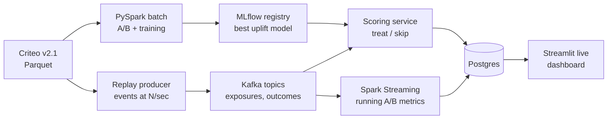

# Uplift & Causal Inference: Who Should We Target?

Sep 25, 2026 · @Trilokesh Venkata Uday

## Overview

Build an end-to-end system that answers two business questions from a randomized ad campaign: **did the campaign work**, and **which users should we target next time** to maximize incremental conversions per rupee spent.

Most fresher portfolios predict *who will convert*. This project predicts *who will convert because of the treatment*. That is the question product, growth and marketing DS teams actually get asked.

**What it proves to a hiring manager:**

- A/B test analysis done properly: randomization checks, confidence intervals, power, variance reduction (CUPED)
- Causal ML: meta-learners (S/T/X) and causal forests for heterogeneous treatment effects
- Correct evaluation of uplift models (Qini and uplift curves), which ordinary accuracy metrics cannot do
- Turning a model into a decision: a targeting policy with a projected business impact
- Working at scale: \~14M rows processed with PySpark, then replayed as a real-time Kafka event stream with live scoring

**Core question framed for the README:** *Given a fixed budget to show ads to 30% of users, who should they be, and how many extra conversions does that buy versus random targeting?*

## Dataset

Use the [Criteo Uplift Prediction Dataset](https://ailab.criteo.com/criteo-uplift-prediction-dataset/), built from real randomized incrementality tests where a random slice of users was held out from advertising.

| Property | Value |
| --- | --- |
| Rows (original release) | 25,309,483 users |
| Rows (corrected v2.1) | \~14M users (approximate; confirm on download) |
| Features | f0–f11, dense floats, anonymized and randomly projected |
| Treatment | `treatment` (1 = treated, 0 = control) |
| Outcomes | `visit`, `conversion` (binary) |
| Exposure | `exposure` (user actually saw the ad) |
| Treatment ratio | 0.846 |
| Avg visit rate | 4.13% |
| Avg conversion rate | 0.23% |
| Size | 459 MB compressed CSV |

Figures from the [Criteo AI Lab page](https://ailab.criteo.com/criteo-uplift-prediction-dataset/) unless marked approximate. Cite the paper *A Large Scale Benchmark for Uplift Modeling* (Diemert et al., AdKDD 2018) in your README.

**Caveats to handle explicitly (interviewers love these):**

- **Use v2.1.** The first release had a known issue that could leak treatment information; the corrected version is the standard benchmark now. Loaders: `sklift.datasets.fetch_criteo` or the Hugging Face mirror.
- **Imbalanced treatment (85/15).** Stratify splits on treatment × outcome and report control-group sample size.
- **Rare conversions (\~0.2%).** Use `visit` as the primary outcome for model development, `conversion` as the harder secondary target.
- **Treatment vs exposure.** `treatment` is the randomized assignment (intent-to-treat). `exposure` is post-randomization and must never be a model feature. Optionally estimate the effect on the exposed with an instrumental-variable (CACE) analysis.
- **Anonymized features.** You cannot tell a business story per feature, so the story comes from segments and the targeting policy, not SHAP names.

## Architecture and stack

Two paths share one model. The **batch path** trains and evaluates on the full dataset. The **streaming path** replays the same data through Kafka as live user events, scores each user in real time, and updates the A/B dashboard as outcomes arrive.



The batch path proves the model works; the streaming path proves it can run as a live system. Label it "simulated real-time replay" everywhere.

**How the replay works**

- The producer reads Parquet in shuffled order and emits one `exposure` event per user (features + original treatment flag) at a configurable rate, e.g. 1,000–10,000 events/sec.
- Outcomes are emitted separately to an `outcomes` topic with a random delay (e.g. 5–60 simulated minutes). Real ad systems see delayed labels; joining them correctly is the interesting part.
- The **scoring service** consumes `exposures`, loads the registered model from MLflow, and writes uplift score + treat/skip decision to a `decisions` topic and Postgres.
- The **Spark Structured Streaming** job joins exposures to outcomes by `user_id` with a watermark, then computes windowed visit rates per group, running ATE and its confidence interval.
- Evidently runs on sliding windows of features to flag drift; inject drift mid-replay (e.g. shift f3) to demo the alert.
- The original random `treatment` stays the ground truth for measuring effects. The model's decisions show *what the policy would have done*, compared against what actually happened.

| Layer | Tools | Why |
| --- | --- | --- |
| Batch processing | PySpark, Parquet | 14M+ rows; Big Data skills in a DS project |
| Streaming | Kafka (KRaft mode), confluent-kafka producer | Event replay, topics, partitions, consumer groups |
| Stream processing | Spark Structured Streaming | Stream-stream join with watermark, windowed aggregates |
| Statistics | statsmodels, SciPy | Bootstrap CIs, power, CUPED-style adjustment, sequential tests |
| Causal ML | CausalML or EconML, scikit-uplift | Meta-learners, causal forests, Qini/uplift curves |
| Base learners | LightGBM, XGBoost | Fast, strong on tabular data |
| Model registry | MLflow | Tracking + the model the scorer loads |
| Serving | FastAPI, Docker | Kafka consumer + `/score` endpoint |
| Storage | Postgres | Decisions and running metrics for the dashboard |
| Monitoring | Evidently | Windowed feature drift |
| Dashboard | Streamlit | Live A/B metrics, decision feed, budget slider |
| Infra | docker-compose, GitHub Actions | One command brings up the full stack |

**Repo structure**

```
uplift-targeting/
├── data/                  # gitignored; download script only
├── notebooks/             # 01_eda, 02_ab_test, 03_uplift, 04_policy
├── src/uplift/
│   ├── etl.py             # PySpark: CSV → Parquet, splits
│   ├── ab_test.py         # ATE, CIs, CUPED, SRM, power, mSPRT
│   ├── models.py          # S/T/X-learners, causal forest wrappers
│   ├── evaluate.py        # Qini, uplift@k, calibration by decile
│   └── policy.py          # budget-constrained targeting simulation
├── streaming/
│   ├── producer.py        # replay exposures + delayed outcomes
│   ├── scorer.py          # consume, score, publish decisions
│   └── ab_stream.py       # Spark Structured Streaming job
├── api/main.py            # FastAPI /score, /policy, /health
├── app/dashboard.py       # Streamlit live view
├── tests/
├── docker-compose.yml     # kafka, spark, postgres, mlflow, api, app
├── Makefile               # make data | train | replay | serve
└── README.md
```

## Build plan

Seven phases, each ending in something you can show. Do not start modeling until Phase 2 is written up; the A/B analysis is half the project's value.

### Phase 1 — Data and sanity checks

- [ ] Download v2.1; PySpark job converts CSV to Parquet and logs row counts
- [ ] Sample Ratio Mismatch (SRM) check: chi-square test that the observed 85/15 split matches design
- [ ] Covariate balance: standardized mean difference for f0–f11 between groups (all should be < 0.1)
- [ ] Stratified train / validation / test split (60/20/20) on treatment × visit
- [ ] EDA notebook: outcome rates by group, feature distributions, correlation

### Phase 2 — Classic A/B test analysis

- [ ] Average treatment effect (ATE) on visit and conversion: difference in means, relative lift
- [ ] 95% confidence intervals two ways: normal approximation and bootstrap (run the bootstrap in Spark)
- [ ] CUPED: use pre-treatment covariates to reduce variance; report % variance reduction and narrower CI
- [ ] Power analysis: minimum detectable effect at this sample size; how many users a smaller test would need
- [ ] Optional: effect on the actually-exposed (CACE) using `treatment` as an instrument for `exposure`
- [ ] One-page written verdict: "Did the campaign work, by how much, how sure are we?"

The CUPED-adjusted outcome, with θ fit on covariate X:

```latex
Y_{cuped} = Y - \theta\,(X - \bar{X}), \qquad \theta = \frac{\mathrm{Cov}(Y, X)}{\mathrm{Var}(X)}
```

### Phase 3 — Uplift models

Train each on the same split, predict individual uplift τ(x) = P(Y=1 | treated, x) − P(Y=1 | control, x).

| Model | Idea | Library |
| --- | --- | --- |
| Random targeting | Baseline | none |
| Response model | Classic "who converts" classifier (the naive approach you beat) | LightGBM |
| S-learner | One model with treatment as a feature | CausalML |
| T-learner | Separate models for treated and control | CausalML |
| X-learner | T-learner + imputed effects, handles 85/15 imbalance | CausalML |
| Class transformation | Relabel so one classifier learns uplift directly | scikit-uplift |
| Causal forest | Trees split to maximize effect heterogeneity | EconML |

- [ ] Log every run to MLflow with Qini AUC, uplift@10/20/30%
- [ ] Tune the top two with Optuna on the validation set only

### Phase 4 — Evaluation

- [ ] Qini and uplift curves for all models on one plot, with the random line
- [ ] Uplift by decile: bar chart of observed treated − control rate per predicted-uplift decile (should decrease)
- [ ] Identify the four segments: persuadables, sure things, lost causes, sleeping dogs (negative uplift)
- [ ] Bootstrap CIs on Qini AUC so model differences are not noise

### Phase 5 — Targeting policy and business impact

- [ ] Budget simulation: for k = 5%…100% targeted, incremental conversions from uplift ranking vs response ranking vs random
- [ ] Pick an operating point and state it in rupees: assume a cost per impression and value per conversion (clearly labeled assumptions)
- [ ] Show the savings from *not* targeting sure things and sleeping dogs

### Phase 6 — Real-time replay

- [ ] docker-compose with Kafka (KRaft), Spark, Postgres, MLflow; `make up` brings it all up
- [ ] Producer: shuffled replay of the **test split only** into `exposures` (keyed by `user_id`, 6 partitions), rate flag `--eps 5000`
- [ ] Delayed outcomes: publish `visit`/`conversion` to `outcomes` after a random simulated lag
- [ ] Scorer: consumer group loads the MLflow "Production" model, micro-batches of 500, writes decisions to `decisions` topic + Postgres
- [ ] Spark Structured Streaming: stream-stream join with a watermark, 1-minute windows of visit rate by group and running ATE ± CI
- [ ] Sequential testing: show the naive running p-value crossing 0.05 early ("peeking"), then an always-valid mSPRT confidence sequence that doesn't
- [ ] Drift demo: shift one feature halfway through the replay; Evidently flags it in the dashboard
- [ ] Consistency check: final streaming ATE must match the batch ATE from Phase 2 on the same split
- [ ] Load test: max sustained events/sec and p95 scoring latency; record both for the README

### Phase 7 — Serving and presentation

- [ ] FastAPI: `POST /score` returns uplift + treat/don't-treat; `GET /policy?budget=0.3` returns expected lift
- [ ] Streamlit: budget slider, Qini curves, decile chart, A/B verdict card
- [ ] Dockerfile, Makefile, GitHub Actions running tests and a small-sample training smoke test
- [ ] README written as a case study (problem → result → method), plus a 2-minute Loom walkthrough

## Evaluation and success criteria

The project succeeds when the best uplift model beats both random and response-model targeting on held-out Qini AUC, with non-overlapping bootstrap CIs.

| Metric | What it measures | Target |
| --- | --- | --- |
| SRM p-value | Randomization is intact | > 0.01 |
| Covariate SMD | Groups are balanced | < 0.1 for every feature |
| ATE + 95% CI | Did the campaign work overall | CI excludes 0 for `visit` |
| CUPED variance reduction | Precision gained from covariates | Report the %; any reduction counts |
| Qini AUC (normalized) | Ranking quality for uplift | Best model > response model > random |
| Uplift@30% | Incremental conversions if targeting top 30% | Report vs random at same budget |
| Decile monotonicity | Predicted uplift matches observed uplift | Observed uplift falls across deciles |
| Streaming vs batch ATE | Stream join and windows are correct | Within 1% of the batch estimate |
| Sustained throughput | Replay pipeline capacity | Report max events/sec with no growing consumer lag |
| Scoring latency | Real-time decisions are usable | p95 < 50 ms per event |
| Drift detection | Monitoring works | Injected shift flagged within 2 windows |

**Two honesty notes for the README:**

- Classic CUPED uses the *same metric from a pre-experiment period*. This dataset has no pre-period, so you are doing regression adjustment on pre-treatment covariates (CUPED-style). Say so; interviewers will respect it.
- Criteo sub-sampled the data non-uniformly for privacy, so the absolute lift is not Criteo's real lift. Present results as method comparisons, not as a claim about Criteo's ads.

## Deliverables, resume bullets, interview prep

Ship four things: the GitHub repo, a live Streamlit dashboard, a written A/B verdict, and a short case-study blog post (Medium or LinkedIn).

**README checklist**

- [ ] One-line result at the top (e.g. "Uplift targeting delivers X% more incremental visits than response-model targeting at a 30% budget")
- [ ] Qini curve image and decile chart above the fold
- [ ] Problem → approach → results → limitations → how to run
- [ ] `make all` reproduces everything from a clean clone
- [ ] Links: dashboard, blog post, Loom video

**Resume bullets** (fill X/Y/Z with your real numbers; never invent them)

- Built an uplift-modeling pipeline on 14M-row Criteo randomized-trial data (PySpark, CausalML, EconML), identifying persuadable users and lifting incremental visits by X% over response-model targeting at a 30% budget
- Designed A/B test analysis with SRM checks, bootstrap CIs and CUPED-style variance reduction, cutting confidence-interval width by Y%
- Built a real-time replay pipeline (Kafka, Spark Structured Streaming, FastAPI) scoring Z events/sec at p95 < W ms, with delayed-outcome joins, live A/B metrics using always-valid sequential tests, and Evidently drift alerts

**Interview questions to be ready for**

1. Why not just target users with the highest predicted conversion probability?
2. What are "sleeping dogs" and why does targeting them cost money?
3. How do you evaluate an uplift model when you never observe both outcomes for one user?
4. S vs T vs X-learner: when does each fail? Why does X-learner suit an 85/15 split?
5. What is SRM and what do you do if you find it?
6. How does CUPED reduce variance, and why doesn't it bias the estimate?
7. Why must `exposure` never be a feature? What is intent-to-treat?
8. How would you run this as a live experiment next quarter to validate the policy?

## Timeline and stretch goals

Plan for about 4 weeks part-time. Phases 1–2 alone are already resume-worthy if applications can't wait.

| Week | Focus | Done when |
| --- | --- | --- |
| 1 | Phases 1–2: data, SRM, balance, ATE, CUPED, power | Written A/B verdict committed |
| 2 | Phases 3–5: seven models, Qini curves, deciles, policy sim | Best model registered in MLflow |
| 3 | Phase 6: Kafka replay, scorer, streaming A/B, drift demo | Streaming ATE matches batch ATE |
| 4 | Phase 7: API, live dashboard, load test, README, blog | Demo video + dashboard link on resume |

**Stretch goals** (pick at most one)

- **Off-policy evaluation:** estimate your policy's value with inverse propensity weighting and doubly robust estimators
- **Multi-treatment:** extend to a second dataset (e.g. Hillstrom email campaign, 3 arms) and choose the best treatment per user
- **Cloud deploy:** move Kafka to AWS MSK and the scorer to ECS Fargate, with a cost note per million events
- **Observational twist:** drop the randomization, simulate selection bias, and recover the effect with propensity matching; compare against the true RCT answer
